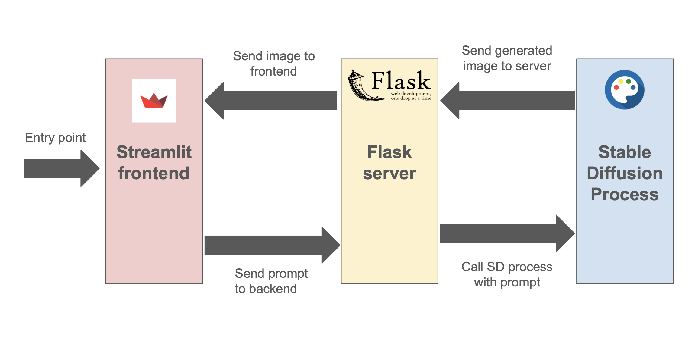

<h1 style="display: inline-block;">Tenstorrent Projects Documentation</h1>

## Tenstorrent Performance Sheet Analyzer
[GitHub](https://github.com/vshenoyTT/perf-sheet-tool) | [Deployment](https://perfsheet.streamlit.app/)

An easy-to-use performance sheet analysis tool for Tenstorrent models. To run locally, install the requirements from `requirements.txt` with the command `pip install -r requirements.txt`. Then, within the directory, run the command `streamlit run streamlit_app.py`. The web tool will open up on a local host port.

The app is built in Streamlit and deployed on the Streamlit Community Cloud. It utilizes Python libraries like Pandas and NumPy to manipulate data and format performance sheets. All of the code is within the `streamlit_app.py` file.

## Tenstorrent Graphing Visualizer
[GitHub](https://github.com/vshenoyTT/graph-tool) | [Deployment](https://tt-graph.streamlit.app/)

Create graphs for Tenstorrent model performance analysis. To run locally, install the requirements from `requirements.txt` with the command `pip install -r requirements.txt`. Then, within the directory, run the command `streamlit run streamlit_app.py`. The web tool will open up on a local host port.

The app is built in Streamlit and deployed on the Streamlit Community Cloud. It utilizes Python libraries like Pandas, NumPy, and MatPlotLib to manipulate data and format performance sheets. All of the code is within the `streamlit_app.py` file.

## Tenstorrent L1 Utilization Graphing Visualizer
[GitHub](https://github.com/vshenoyTT/l1-graph-tool) | [Deployment](https://tt-l1-graph.streamlit.app)

Create graphs to visualize L1 utilization. To run locally, install the requirements from `requirements.txt` with the command `pip install -r requirements.txt`. Then, within the directory, run the command `streamlit run streamlit_app.py`. The web tool will open up on a local host port.

The app is built in Streamlit and deployed on the Streamlit Community Cloud. It utilizes Python libraries like Pandas and MatPlotLib to manipulate data and format performance sheets. All of the code is within the `streamlit_app.py` file, with experimental code using Tkinter and other visualization methods in the SQL file.

## Tenstorrent Stable Diffusion Web Playground
[GitHub](https://github.com/vshenoyTT/sd-backend)

A “Web Playground” for Stable Diffusion on Tenstorrent Wormhole devices. A more customer-focused and visualized demo in comparison to the current CLI interactive demo. Instructions to run this demo are in the `ReadMe`.

The web playground has three components which communicate to form the functioning program. The frontend interface is a simple Streamlit app (`streamlit_app.py`). The backend is split into two components: a Stable Diffusion generation process (`sdserver.py`) and a separate Flask communication server (`flaskserver.py`). The Flask server is used to communicate queries and responses between the frontend and the Stable Diffusion generation process. The diagram below illustrates this flow.

</img>

